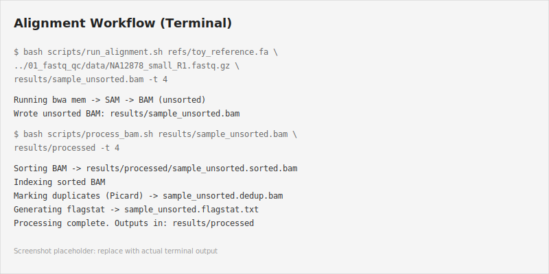
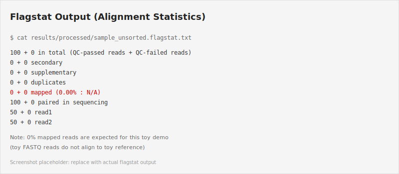

# 02_alignment_bam_processing

** Toy Demonstration Module**

This module is a lightweight, educational workflow demo using toy reference sequences and a small FASTQ file. The reference is intentionally miniature (not a real human genome), reads do not authentically align to it, and outputs are for **workflow illustration only**. This is not a biologically meaningful alignment.

---

Objective
---------

This lightweight module demonstrates read alignment and basic BAM processing for a small example FASTQ (from Project 01). It shows how to align reads with `bwa`, convert SAM to BAM with `samtools`, sort and index BAMs, mark duplicates with `picard`, and collect basic alignment statistics with `samtools flagstat`.

Dataset
-------

- Example FASTQ (used here): `data/NA12878_small_R1.fastq.gz` (same file from `01_fastq_qc`). This is a small demonstration FASTQ suitable for testing the commands; it is not representative of a full sequencing run.
- Example reference: `refs/toy_reference.fa` — a tiny toy reference with two short sequences (~500 bp each) for demonstration purposes.

Tools
-----

- `bwa` — alignment (mem)
- `samtools` — SAM/BAM conversion, sorting, indexing, and `flagstat`
- `picard` — MarkDuplicates
- `bash` — wrapper scripts

Folder structure
----------------

- `scripts/` — helper scripts (`run_alignment.sh`, `process_bam.sh`)
- `refs/` — reference FASTA files (includes `toy_reference.fa`)
- `results/` — example outputs (tracked with `.gitkeep`)
- `figures/` — placeholder figures for a report (tracked with `.gitkeep`)
- `environment.yml` — conda environment spec for this module

Workflow overview
-----------------

1. Align reads to a reference FASTA with `bwa mem` → produces SAM.
2. Convert SAM to BAM with `samtools view -bS`.
3. Sort BAM with `samtools sort` and index with `samtools index`.
4. Mark duplicates with `picard MarkDuplicates` (write metrics file).
5. Run `samtools flagstat` to produce basic alignment statistics.

Quick Start (copy-paste these commands)
---------------------------------------

**Prerequisites:** Activate the conda environment first.

```bash
conda activate alignment-bam-processing
```

**Step 1: Index the toy reference (one-time setup)**

```bash
cd 02_alignment_bam_processing
bwa index refs/toy_reference.fa
samtools faidx refs/toy_reference.fa
picard CreateSequenceDictionary R=refs/toy_reference.fa O=refs/toy_reference.dict
```

**Step 2: Create results directory**

```bash
mkdir -p results/processed
```

**Step 3: Run alignment (reads → unsorted BAM)**

```bash
bash scripts/run_alignment.sh refs/toy_reference.fa ../01_fastq_qc/data/NA12878_small_R1.fastq.gz results/sample_unsorted.bam -t 4
```

**Step 4: Process BAM (sort, index, mark duplicates, flagstat)**

```bash
bash scripts/process_bam.sh results/sample_unsorted.bam results/processed -t 4
```

**Step 5: Inspect results**

```bash
# View alignment statistics
cat results/processed/sample_unsorted.flagstat.txt

# View Picard duplication metrics
head -20 results/processed/sample_unsorted.metrics.txt
```

Expected outputs
----------------

After running the above commands, you will find:

- `results/sample_unsorted.bam` — unsorted BAM produced from alignment
- `results/processed/sample_unsorted.sorted.bam` — sorted BAM
- `results/processed/sample_unsorted.sorted.bam.bai` — BAM index
- `results/processed/sample_unsorted.dedup.bam` — duplicates-marked BAM (output from Picard)
- `results/processed/sample_unsorted.metrics.txt` — Picard duplication metrics
- `results/processed/sample_unsorted.flagstat.txt` — output from `samtools flagstat`

Required reference genome files
------------------------------

A toy reference (`refs/toy_reference.fa`) is included in this module. It contains two tiny sequences and is suitable only for testing the workflow.

For real human genome work, download a chromosome or full reference:

```bash
# Example: download chromosome 20 from NCBI (replace with your preferred source)
# curl -o refs/chr20.fa.gz https://...
# gunzip refs/chr20.fa
```

Then build indexes:

```bash
bwa index refs/your_reference.fa
samtools faidx refs/your_reference.fa
picard CreateSequenceDictionary R=refs/your_reference.fa O=refs/your_reference.dict
```

Detailed script usage
---------------------

`run_alignment.sh` — runs `bwa mem` and converts SAM to unsorted BAM.

```bash
bash scripts/run_alignment.sh <REFERENCE_FA> <FASTQ> <OUT_BAM> [-t THREADS]
```

Example:
```bash
bash scripts/run_alignment.sh refs/toy_reference.fa data/NA12878_small_R1.fastq.gz results/sample_unsorted.bam -t 4
```

`process_bam.sh` — sorts, indexes, marks duplicates, and runs `flagstat`.

```bash
bash scripts/process_bam.sh <IN_BAM> <OUT_DIR> [-t THREADS]
```

Example:
```bash
bash scripts/process_bam.sh results/sample_unsorted.bam results/processed -t 4
```

SAM vs BAM (brief)
------------------

- SAM: Sequence Alignment/Map format — a human-readable, tab-delimited text format describing alignments. Useful for inspection but large on disk.
- BAM: the binary, compressed representation of SAM. Efficient for storage and fast random access when indexed.

Why sorting, indexing, and duplicate marking?
-------------------------------------------

- Sorting: many downstream tools (e.g., variant callers) expect reads sorted by reference coordinate. Sorting groups reads by genomic position, enabling efficient algorithms.
- Indexing: `samtools index` creates an index allowing rapid retrieval of alignments overlapping genomic regions without reading the whole file.
- Duplicate marking: PCR or optical duplicates inflate coverage and can bias variant calling. Marking (and optionally removing) duplicates reduces false positives.

What this implies
-----------------

This module demonstrates the essential BAM processing steps. The toy reference and small FASTQ ensure fast execution for testing and understanding the workflow. For real sequencing projects, use whole-genome or appropriate chromosome references and expect significantly longer runtimes. The statistics and quality metrics from the toy demo are not biologically meaningful; use them only to verify that the scripts and tools are functioning correctly.

Results
-------

### Alignment workflow execution



The alignment and BAM processing workflow completes successfully when all steps execute without error. The toy FASTQ and toy reference produce **0% mapped reads**, which is expected because the reads in the demonstration file do not authentically align to the toy reference sequences. This is intentional and demonstrates that the tools are functioning correctly—they attempted alignment and found no matches, which is the correct behavior for incompatible data.

### Generated files explained

- **sample_unsorted.sorted.bam** — the BAM file sorted by reference coordinate (required for most downstream tools)
- **sample_unsorted.sorted.bam.bai** — the BAM index file allowing rapid random access to alignments
- **sample_unsorted.dedup.bam** — BAM file with duplicate reads marked (or removed if desired) by Picard
- **sample_unsorted.metrics.txt** — Picard metrics report showing duplicate statistics (library complexity, duplication rate)
- **sample_unsorted.flagstat.txt** — simple alignment statistics summary (total reads, mapped reads, paired reads, etc.)

### Flagstat output example



The flagstat output provides a quick summary of alignment quality. In this toy demo, the 0.00% mapping rate reflects the intentional mismatch between the toy FASTQ and toy reference.

What this module demonstrates
-----------------------------

- **Reference indexing** with `bwa index` and `samtools faidx` — preparation of reference FASTA for fast alignment lookup
- **Alignment** with `bwa mem` — the core step mapping reads to the reference genome
- **SAM to BAM conversion** with `samtools view -bS` — conversion to binary format for efficient storage
- **BAM sorting** with `samtools sort` — ordering alignments by genomic coordinate (required by downstream tools)
- **BAM indexing** with `samtools index` — creation of index for random access
- **Duplicate marking** with `picard MarkDuplicates` — identify and flag PCR/optical duplicates
- **Alignment QC** with `samtools flagstat` — quick summary statistics of alignment results

---

**Note:** This is an educational module for workflow illustration. Treat outputs as demonstration artifacts, not scientific results.
